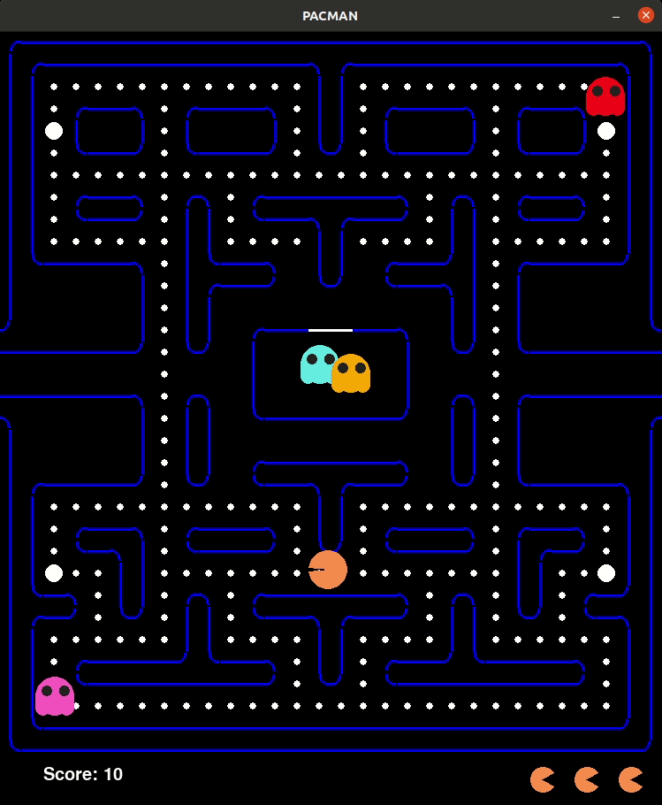

ee# group4_pacman
# Game Instruction

In this game, your objective is to guide the iconic character, Pacman, as he roams around the pathways, eating all the dots scattered throughout. You need to clear the road by devouring every dot you encounter within a limited number of lives. Eating the dots will increase your score (eating each small dot gets 10 points, and eating each big dot gets 50 points), the score will be shown on the lower-left corner of the screen. 

You can control Pacman's movement using the arrow keys on your keyboard. Press the up arrow to move Pacman upward, the down arrow to move him downward, and so on. 

Avoid coming into contact with the ghosts. If Pacman touches a ghost, he will be eaten, losing one life, and goes back to its original place to restart again. You start the game with three lives, indicated by Pacman's life icon on the lower right corner of the screen. When all three lives are lost, the game ends, and if you haven't eaten up all the dots, you will fail.

Occasionally, you will come across big dots located in four parts of the maze. When Pacman consumes a big dot, the ghosts' will become vulnerable and do no harm to Pacman for 10 seconds. During this time, you can safely pass through the ghosts.

Your goal is to control Pacman to clear the maze of all the dots before losing all your lives.

# Game download and run
## Ubuntu
git clone the game:
```
$ cd ~
$ git clone git@github.com:ARG-NCTU/oop-proj-4-pacman.git
```
Run docker
```
$ cd oop-proj-4-pacman
$ source docker_run.sh
```
Start the game
```
$ python3 main.py
```
## Windows
Install Anaconda from following site.
https://docs.anaconda.com/free/anaconda/install/windows/
### Download oop-proj-4-pacman
Download oop-proj-4-pacman as a zip, and unzip.
### activate base env, and start the game
You can change "oop_env" to what ever the name you like.
```
$ conda create --name oop_env python=3.8.10
$ conda activate oop_env
$ conda install -c conda-forge pygame
$ conda install -c conda-forge numpy
```
cd to your oop-proj-proj-4-pacman dir location, and run the game.
```
$ cd oop-proj-proj-4-pacman
$ python main.py
```
