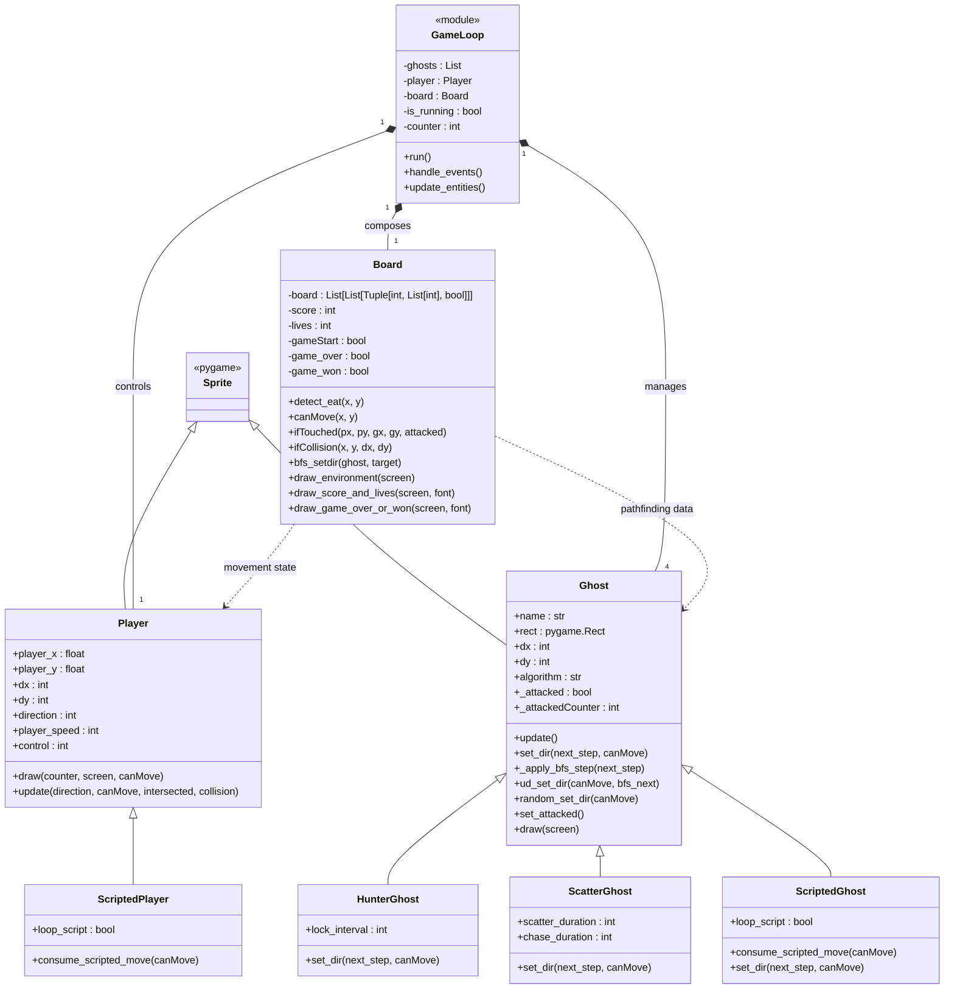

# UML Class Diagram

The diagram below summarizes the main runtime classes that power the playable loop in `game.py`. It focuses on how the orchestrating game loop composes the environment model (`Board`), the player avatar, and the collection of ghosts that inherit from `pygame.sprite.Sprite`.

Notes:
- `GameLoop` is drawn as a module stereotype because the logic in `game.py` is implemented procedurally rather than as a formal class. It still behaves like a controller that owns and updates the other objects.
- The `Board`’s `board` field stores, for each tile, the map symbol, allowed directions, and an “intersection” flag generated by `intersect_map`.
- Both `Player` and `Ghost` inherit from `pygame.sprite.Sprite`, which provides fundamental rendering and collision-rectangle behavior supplied by the external Pygame library.
- `HunterGhost` inherits from `Ghost` but throttles how often it can turn, which makes it commit to corridors before changing direction again.
- `ScatterGhost` alternates between random “scatter” movement and directed BFS chases, giving the blue ghost a predictable rhythm between phases.
- `ScriptedPlayer` extends `Player` and automatically replays a predetermined sequence of moves, which is useful for automated demos and tests where no keyboard input is available.
- `ScriptedGhost` extends `Ghost` so automated demos can drive ghosts through predetermined paths before falling back to the normal targeting algorithm.
